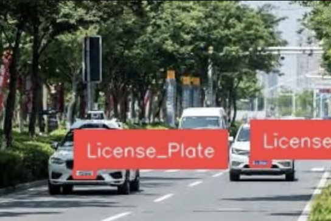
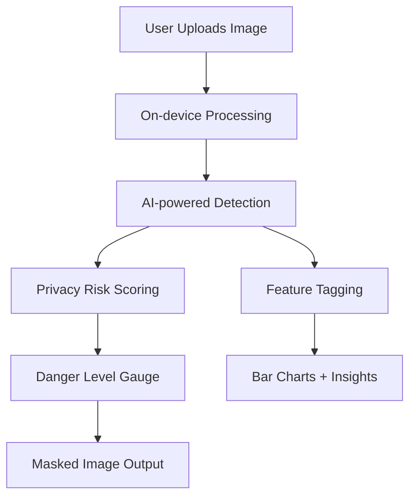

# Tiktok TechJam 25 - Thunderbolt 
**Privacy Meets AI: Building a Safer Digital Future**

AI-powered visual privacy protection — detect, tag, and mask sensitive information from your images before they leak.

---

## Problem Statement
As AI integrates deeper into our daily lives, **privacy risks** grow more pressing.  
From hidden location cues in photos to unauthorized data leaks, users face challenges in controlling how their data is exposed.

**Thunderbolt** addresses this problem by combining **Generative AI** with **privacy-first design**:

### **1. Making AI Systems Resilient Against Attacks & Misuse**
- **Local On-Device Processing** — processes images locally whenever possible, reducing reliance on cloud inference and minimizing security risks.
- **No Data Retention** — images are not stored after detection, preventing re-identification or unauthorized reuse.
- **Robust Detection Pipeline** — multi-layered detection flags potentially malicious or privacy-invasive inputs early.
- **Privacy-Preserving Defaults** — sensitive feature detection and masking are always enabled by default.

### **2. Using AI to Protect Users' Privacy**
- **Sensitive Feature Detection** — identifies faces, license plates, signs, and other geo-inferable elements automatically.
- **Danger-Level Scoring** — quantifies image sensitivity with a percentage-based privacy risk score.
- **Automatic Privacy Protections** — blurs or masks sensitive areas to prevent location leakage and identity exposure.
- **Explainable Insights** — shows users which features were flagged, why, and how they were masked.

---

## Features
### Risk Detection Dashboard
- Upload an image and **instantly analyze potential privacy risks**.
- Detect identifying cues like:
  - Faces
  - Road signs
  - Building structures
  - License plates
  - Location-sensitive elements

### Dynamic Danger Level Gauge
- AI-powered scoring system highlights the **risk level** of each uploaded image.
- Color-coded gauge:
  - 🟢 **Low Risk**
  - 🟡 **Medium Risk**
  - 🔴 **High Risk**

  



### Automated Privacy Protection
- Blur or mask sensitive regions in images (e.g., plates, street signs).
- Designed to prevent **geo-location inference** and **identity exposure**.

### Interactive Visualizations
- **Circular gauge**: Displays the **danger percentage** intuitively.
- **Bar chart**: Highlights the **count of detected sensitive features**.

---

## System Architecture



- **Frontend:** React (Lynx mini-app framework)
- **AI Engine:** Integrates **generative AI** models for detection and inference
- **Privacy Layer:** Image processing techniques to blur/mask sensitive regions

---

## Tech Stack

### **Frameworks & Libraries**
- **React (Lynx)** — UI/UX development
- **TypeScript** — Strong typing for safer, cleaner code
- **CSS Modules** — Encapsulated styling for components
- **Generative AI APIs** — Model inference and location-based sensitivity scoring

### **Development Tools**
- **Visual Studio Code (VSCode)** — for project development, debugging, and code management.
- **Lynx Mini-App Framework** — frontend framework for seamless mobile-native UI development.
- **Node.js & npm** — used for dependency management and running the development server.
- **Git & GitHub** — version control and collaborative development.
- **Jupyter / Colab** — quick experimentation for AI detection models.

### **Key Components**

| File               | Description                                               |
|--------------------|-------------------------------------------------------|
| `Thunderbolt.tsx`  | Main dashboard & detection logic                      |
| `HomeGpt.tsx`      | Welcome page with result visualization               |
| `Query.tsx`        | Handles uploads, previews, circular gauges, bar charts |
| `App.tsx`          | Entry point for Lynx mini-app                         |
| `Router.tsx`       | Manages page routing within the app                  |

---

## 🔗 APIs & Assets Used

### **AI Models**
- Open-source detection models: **YOLOv8** / **CLIP-based analysis**
- Generative AI: **OpenAI** for location-risk predictions
- **Roboflow OCR API**: for text extraction from images to detect location-revealing information

### **Assets**
- Custom icons:
  - `homeIcon.png`
  - `boltIcon.png`
- Brand-specific UI elements

---

## How It Works

### **Step 1 — Upload & Local Preprocessing**
- Images are uploaded from the user’s device.
- Metadata such as EXIF location tags is **automatically stripped** to prevent accidental leaks.

### **Step 2 — Analyze with AI-Powered Privacy Risk Detection**
- Thunderbolt uses **Roboflow OCR API** to extract visible text and other sensitive from uploaded images. This helps flag sensitive location-revealing information such as:
  - Faces
  - Vehicle plates
  - Landmarks & building patterns
  - Road signs or street names

### **Step 3 — Privacy Risk Scoring**
- The system quantifies **privacy exposure** using:
  - **Danger-level scoring** (0–100%)
  - Context-aware risk thresholds based on detected features.

### **Step 4 — Automated Privacy Protection**
- High-risk areas are **blurred, masked, or noise-injected** dynamically.
- Output images are optimized for **safe sharing** online.

### **Step 5 — Explainable Insights**
- Thunderbolt provides **visual analytics**:
  - A **circular danger gauge** for risk at a glance.
  - A **bar chart** showing how many sensitive features were detected.

---

## Future Enhancements

### **1. On-device AI**
- Process images entirely on-device for **maximum privacy**.

### **2. Generative Adversarial Masking**
- Use AI to create **context-preserving blurs** for masked areas.

### **3. Social Media Integration**
- Pre-scan images before sharing to ensure **no sensitive data leaks**.

### **4. Real-Time Video Privacy**  
- Extend detection and masking to live video streams.

---

## Installation

### **Clone the repository**
```bash
git clone https://github.com/<your-org>/thunderbolt
```

### **Navigate into the project**
```bash
cd thunderbolt
```

### **Install dependencies**
```bash
npm install
```

### **Start development server**
```bash
npm start
```

---

## 📜 License
This project is released under the **MIT License**.  
See the full license text [here](https://opensource.org/licenses/MIT).

---
